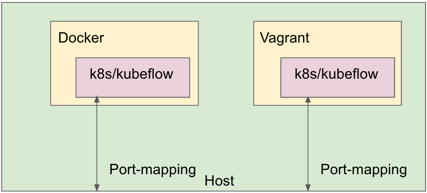

# multikf
Multi-Kind leverages [Vagrant](https://github.com/hashicorp/vagrant) and [Kind](https://github.com/kubernetes-sigs/kind) (Kubernetes In Docker) to create multiple local kubernetes and kubeflow clusters inside the same host machine, see the following png for simple layout


#### Why we need this?

As a machine gets more powerful, it is such a waste to have it running just one Kubernetes, especially for the applications which require only a local Kubernetes for practice. One example is our [Kubeflow workshop](https://github.com/footprintai/kubeflow-workshop).
To fully utilize hardware resources, we leverage vagrant to construct a fully isolated environment and install required packages on it (e.g. Kubernetes and Kubeflow and more ...), map ports for kubeApi and ssh, and also export its kubeconfg to host. Therefore, users on the host machine can easily talk to the guest Kube-API via kubectl.

#### When we need this?

We expected the user are under:

- Windows environemnt with docker desktop installed
- Linux environment

and this tool provides abstractions for them to operate clusters.

#### Why Vagrant is required?

Idealy, we could just use Kind which running as a container to provide resource isolation. However, Kind was unable to isolate resources from its underlying kubelet(see [issue](https://github.com/kubernetes-sigs/kind/issues/877)) due to kubelet's implementation. Thus, Vagrant is served as a resource isolation and provide clean guest enviornment.

NOTE: Vagrant is not battle-tested, so use it with your cautions.

#### How to use?

Usage:
  multikf add <machine-name> [flags]

Flags:
      --cpus int               number of cpus allocated to the guest machine (default 1)
      --export_ports string    export ports to host, delimited by comma(example: 8443:443 stands for mapping host port 8443 to container port 443)
      --f                      force to create instance regardless the machine status
  -h, --help                   help for add
      --memoryg int            number of memory in gigabytes allocated to the guest machine (default 1)
      --use_gpus int           use gpu resources (default: 0), possible value (0 or 1)
      --with_ip string         with a specific ip address for kubeapi (default: 0.0.0.0) (default "0.0.0.0")
      --with_kubeflow          install kubeflow modules (default: true) (default true)
      --with_password string   with a specific password for default user (default: 12341234) (default "12341234")


##### Add a vagrant machine named test000 with 1 cpu and 1G memory.

```
./multikf add test000 --cpus 1 --memoryg 1 --provisioner=vagrant
```
 
 ##### Add a docker machine named test001 with 1 cpu, 1G memory, and all gpus.

```
./multikf add test000 --cpus=1 --memoryg=1 --use_gpus=1 --provisioner=docker
```
 
 
 ##### Add a docker machine named test002 with 1 cpu, 1G memory, and password for helloworld.

```
./multikf add test000 --cpus=1 --memoryg=16 --with_password=helloworld --provisioner=docker
```

##### Export a vargant machine's kubeconfig
```
./multikf export test000 --kubeconfig_path /tmp/test000.kubeconfig

run kubectl from host

 kubectl get pods --all-namespaces --kubeconfig=/tmp/test000.kubeconfig
```


##### list machines

```
./multikf list

+---------+------------------+---------+------+---------------+
|  NAME   |       DIR        | STATUS  | CPUS |    MEMORY     |
+---------+------------------+---------+------+---------------+
| test000 | .vagrant/test000 | running |    1 | 70720/1000328 |
+---------+------------------+---------+------+---------------+
```

##### delete a machine

```
./multikf delete test000

```

#### connect a machine

```
./multikf connect kubeflow test000

```

#### Roadmap

Fields listed here is on our roadmap.

| Fields | machine(Docker) | machine(Vagrant) |
|------|------|------|
| Cpu Isolation | O | O |
| Memory Isolation | O | O |
| GPU Isolation | O | X |
| Expose KubeApi IP | O | O |


#### Gpu Passthough

For passing gpu to docker container, one approach is to use `--gpus=all` when you launched docker container like.

```
docker run -it --gpus=all ubuntu:21.10 /bin/bash

```
where it relies on the host's cuda driver.
However, Kind are NOT supported this approach, see [issue](https://github.com/kubernetes-sigs/kind/pull/1886)
However, we use our [home-crafted kind](https://github.com/footprintai/kind/tree/gpu) for this purpose.
